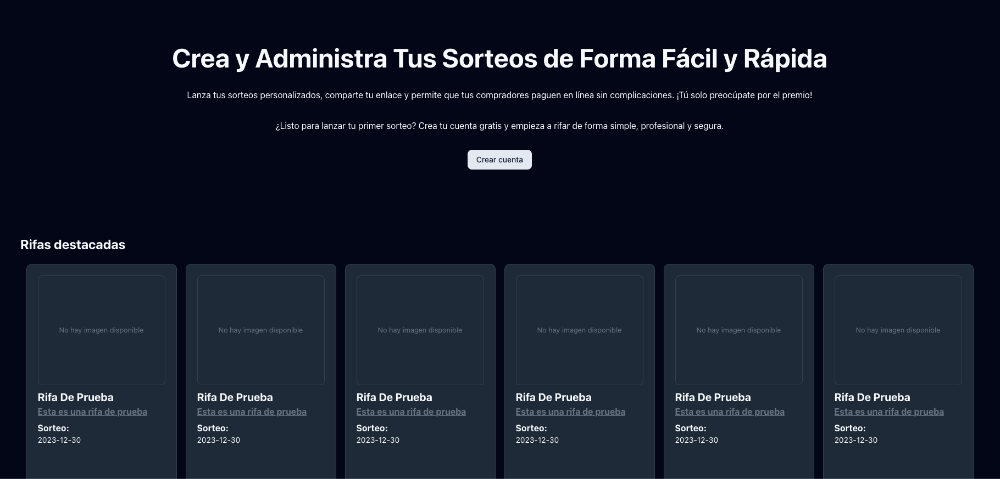
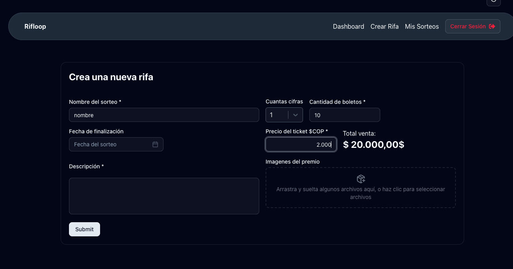
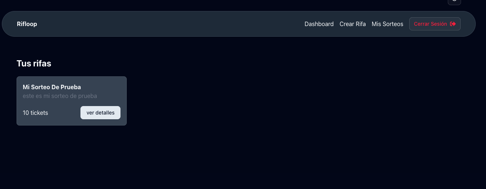
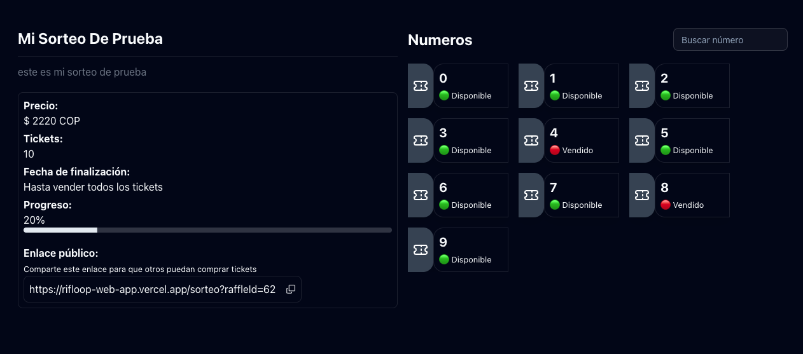
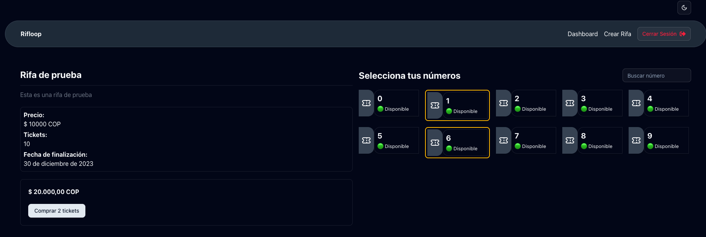
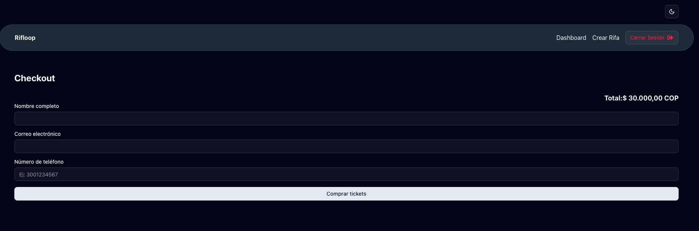

# 🎟️ Rifloop

## 🚀 Demo en Vivo

🔗 [Ver Demo en Vercel](https://rifloop-web-app.vercel.app)

---

## 📋 Descripción del Proyecto

**Rifloop** es una aplicación web para crear y gestionar sorteos en línea, permitiendo a los usuarios vender boletos digitales de manera sencilla y segura.

> ⚠️ **Nota:** Este proyecto es solo de prueba, no ha tenido usuarios reales ni ha estado en producción previamente.

La aplicación está pensada para que cualquier persona pueda crear un sorteo, personalizarlo, subir imágenes del premio y vender boletos digitalmente. El objetivo es ofrecer una experiencia intuitiva y moderna para la gestión de rifas.

---

## 🌓 Modo Claro y Oscuro

La aplicación cuenta con un **toggle** en la parte superior izquierda que permite cambiar fácilmente entre **modo claro (light mode)** y **modo oscuro (dark mode)**, adaptando la experiencia visual a las preferencias del usuario.

---

## 🛠️ Tecnologías Utilizadas

- ⚛️ React
- 🏄 Clerk (gestión de usuarios y autenticación)
- ☁️ Cloudinary (almacenamiento de imágenes)
- 🗃️ IndexedDB (base de datos local en el navegador)
- 💨 Tailwind CSS
- 🧩 Shadcn UI
- ⚡ Vite

---

## 👤 Uso de Clerk

La autenticación y gestión de usuarios en **Rifloop** está implementada completamente con [Clerk](https://clerk.com/):

- Registro e inicio de sesión de usuarios con interfaces modernas de Clerk.
- Protección de rutas privadas (dashboard, creación de sorteos, perfil) usando el estado de sesión de Clerk.
- Visualización y edición del perfil de usuario gracias a los componentes de Clerk.
- Cierre de sesión seguro y redirección automática.

---

## 🖼️ Capturas de Pantalla

### Landing Page



### Formulario de Creación de Rifa



### Dashboard de Usuario



### Detalles de una Rifa



### Selección y Compra de Boletos



### Checkout



---

## 📝 ¿Cómo Funciona?

1. **Registro e Inicio de Sesión:**  
   Los usuarios pueden registrarse o iniciar sesión fácilmente gracias a Clerk.

2. **Creación de Sorteos:**  
   Una vez autenticado, puedes crear una rifa personalizada, subir imágenes del premio, definir el precio y la cantidad de boletos. El formulario calcula automáticamente la cantidad de boletos según el número de cifras seleccionado.

3. **Gestión de Rifas:**  
   Desde el dashboard puedes ver todas tus rifas, acceder a sus detalles y compartir el enlace público.

4. **Compra de Boletos:**  
   Cualquier usuario puede comprar boletos de rifas públicas, seleccionando sus números favoritos y completando el proceso de compra. No es posible comprar boletos ya vendidos.

5. **Checkout:**  
   El estado de los boletos se actualiza automáticamente tras la compra. El proceso de pago es simulado y no se realiza una transacción real.

---

## 📦 Instalación y Ejecución Local

```bash
git clone https://github.com/tuusuario/rifloop.git
cd rifloop
pnpm install
pnpm dev
```

---

## 🎯 Fines Demostrativos y Futuro del Proyecto

**Rifloop** ha sido desarrollado únicamente con fines demostrativos y académicos, cumpliendo con los requisitos del reto:

- No ha tenido usuarios reales ni ha estado en producción previamente.
- Su despliegue y código son públicos para revisión y evaluación.

### 💡 Idea Original y Visión a Futuro

La idea principal de Rifloop es permitir a cualquier persona crear un sorteo y vender los boletos en línea de forma sencilla y segura.  
Sin embargo, la visión original del proyecto iba más allá: **la intención era que los usuarios no solo compraran un boleto, sino que adquirieran una imagen de wallpaper exclusiva, la cual estaría asociada a un número de boleto**. Así, cada boleto vendido sería también una imagen digital única, y el sorteo se convertiría en una experiencia más atractiva y coleccionable.

Por temas de tiempo, esta funcionalidad de compra de imágenes no pudo ser implementada en esta versión. La idea era simplemente asociar los enlaces de las imágenes a los boletos y, posteriormente, mostrarlas al usuario, dando la sensación de que se adquiere una imagen digital que además participa por un premio.

### 🚀 Próximos pasos

- Asociar imágenes únicas a cada boleto vendido.
- Permitir a los usuarios visualizar y descargar su wallpaper adquirido.
- Mejorar la experiencia de compra y personalización de sorteos.
- Explorar integraciones con tecnologías NFT para dar autenticidad a las imágenes.

---
